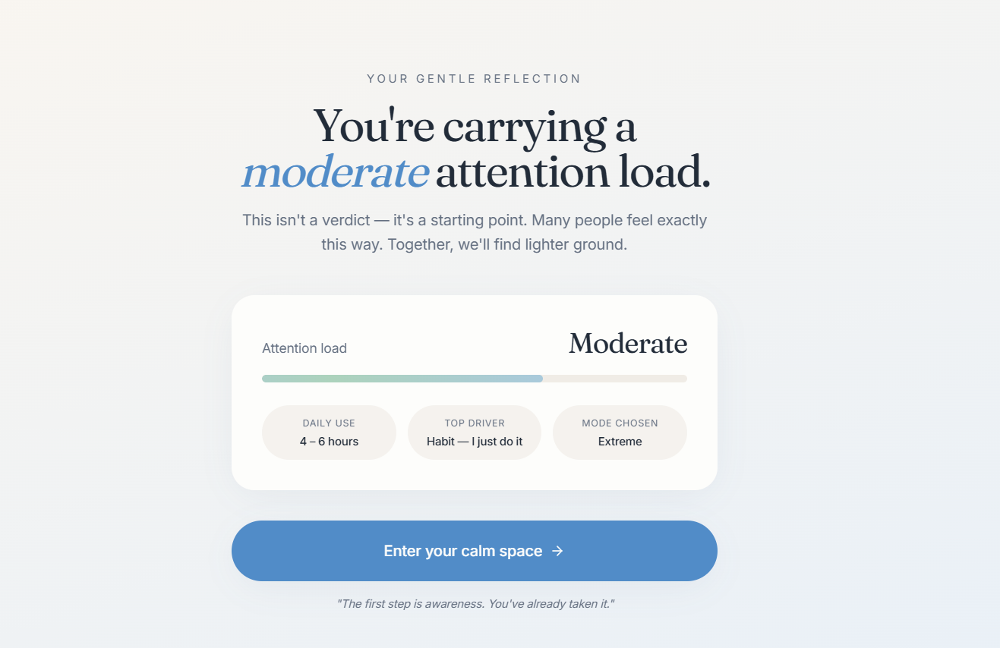
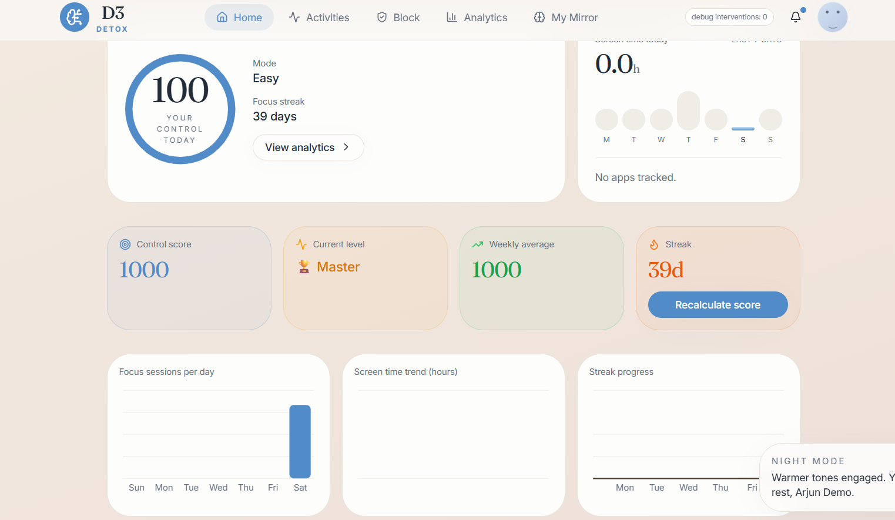
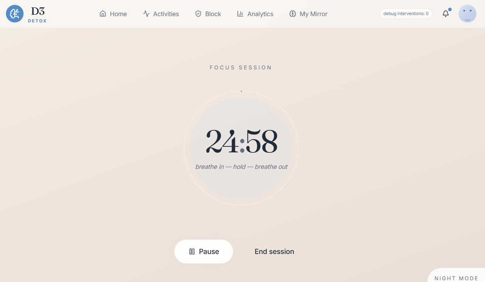
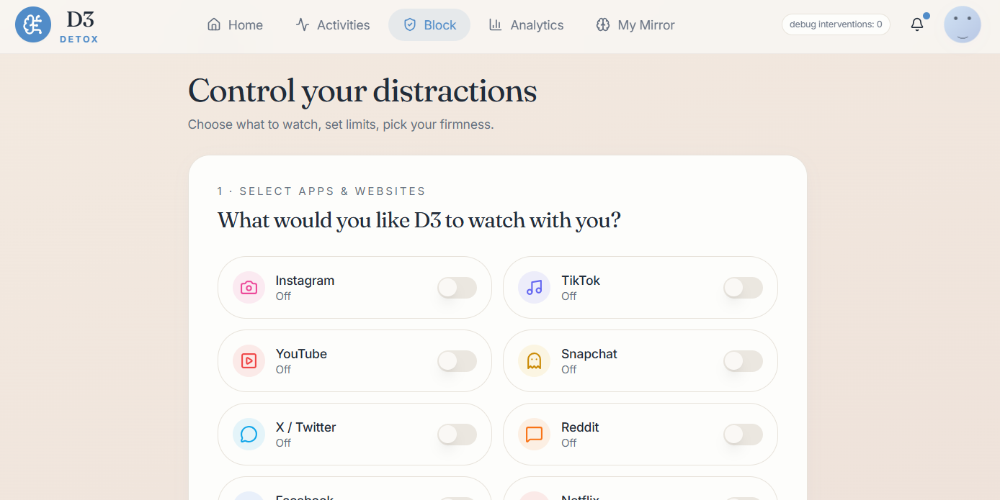
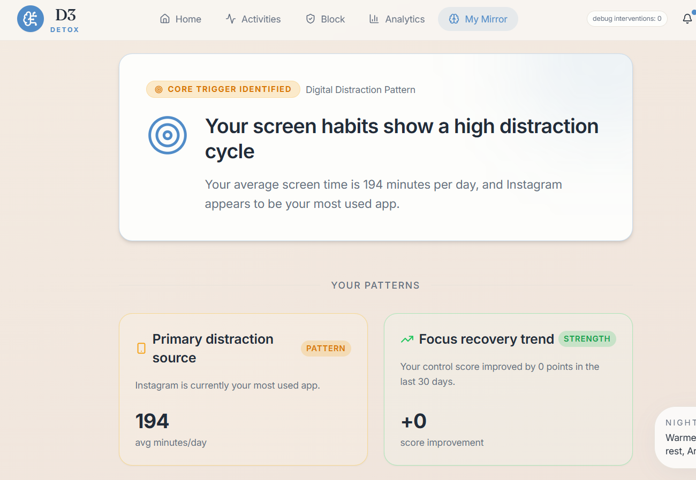
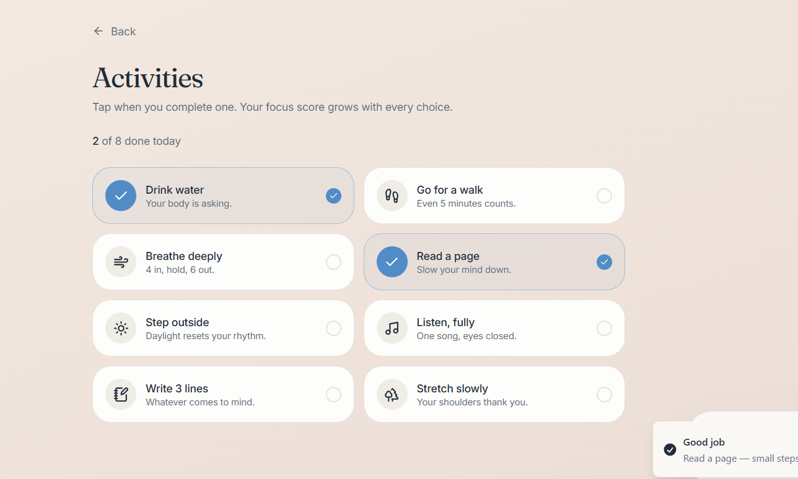

# 🧠 Digital Dopamine Detox  
### Regain focus. Rewire habits. Reclaim your attention.

<p align="center">


</p>

## 🚀 Overview

**Digital Dopamine Detox** is a behavioral intelligence platform designed to help users reduce digital addiction and develop healthier technology habits.

Instead of relying on strict app blocking, the system combines **behavioral analytics, mindful interventions, and reflective insights** to encourage intentional and conscious technology use.

By analyzing patterns such as screen activity, focus sessions, and personal reflections, the platform transforms raw behavioral data into **actionable insights** that help users understand their digital habits and improve their focus over time.

## ✨ Key Features

### 🧭 Smart Onboarding

Users begin with a behavioral onboarding process that learns about their digital habits and creates a personalized detox plan.

Key inputs include:

- Estimated screen time  
- Most distracting apps  
- Sleep schedule  
- Productivity level  
- Self-assessed addiction level  

This information helps the system generate a **personalized digital detox strategy**.

<p align="center">

</p>

---

### 📊 Behavioral Dashboard

The dashboard provides a **real-time overview of digital behavior** and progress.

Key insights include:

- Control score  
- Streak progress  
- Weekly focus analytics  
- Activity summaries  
- Productivity insights  

<p align="center">

</p>

---

### ⏱ Focus Session System

Users can activate distraction-free focus sessions designed for deep work.

Features include:

- Pomodoro-style focus timer  
- Productivity session tracking  
- Focus performance analytics  

<p align="center">

</p>

---

### 🚫 Intervention System

When prolonged usage is detected, the platform introduces **behavioral interventions** to encourage mindful breaks.

Examples include:

- Pause reminders  
- Breathing exercises  
- Hydration prompts  
- Short movement breaks  

These interventions help users **reset attention and avoid unconscious scrolling**.

<p align="center">

</p>

---

### 🪞 Behavioral Mirror (AI Insights)

The Behavioral Mirror analyzes user activity patterns and generates behavioral insights such as:

- Distraction patterns  
- Focus improvement trends  
- Emotional scrolling triggers  
- Habit recovery signals  

This system converts behavioral data into **interpretable psychological insights**.

<p align="center">

</p>

---

### 📓 Reflection Journal

Users can log daily reflections and moods to track emotional and cognitive states.

The system correlates journal data with digital behavior to identify:

- Emotional triggers  
- Productivity patterns  
- Distraction cycles  

<p align="center">

</p>

## 🏗 System Architecture

The platform follows a **full-stack modular architecture** designed for scalability and clear separation of concerns.
```
Frontend (React + Vite + TypeScript)
        ↓
REST API (Node.js + Express)
        ↓
Database (MongoDB + Mongoose)
        ↓
Behavioral Analytics Engine
        ↓
AI Behavioral Mirror
```

---

## 🛠 Tech Stack

### Frontend
- React  
- Vite  
- TypeScript  
- Tailwind CSS  

### Backend
- Node.js  
- Express.js  
- REST API Architecture  

### Database
- MongoDB  
- Mongoose ODM  

### Authentication
- JWT (JSON Web Tokens)

### Data Visualization
- Recharts

### AI Integration
- Claude API (Anthropic)  
- Fallback behavioral analysis engine

---

## 📂 Project Structure
```
d3
│
├── d3-app
│ ├── src
│ ├── components
│ ├── pages
│ └── hooks
│
├── backend
│ ├── controllers
│ ├── models
│ ├── routes
│ ├── middleware
│ └── services
│
└── README.md

```

---

## ⚙️ Installation

### Clone the repository

```bash
git clone https://github.com/anushkash3110/d3.git
cd d3
```

## Install dependencies
## Frontend
```
cd d3-app
npm install
```
## Backend
```
cd backend
npm install
```
## 🔑 Environment Variables

## Create a .env file inside the backend directory.
```
Example configuration:
PORT=5000
MONGO_URI=your_mongodb_connection
JWT_SECRET=your_secret
ANTHROPIC_API_KEY=your_api_key
```
## ▶ Run the Project

Start the backend server:
```
npm run dev
```
Start the frontend application:
```
npm run dev
```
Open the application in your browser:
```
http://localhost:5173
```

## 🌱 Future Improvements
Mobile companion application
AI-powered habit coaching system
Cross-device digital behavior tracking
Advanced behavioral analytics
Personalized detox recommendations

## 💡 Vision

Digital addiction is one of the most significant productivity challenges of the modern era.

Digital Dopamine Detox aims to create tools that increase awareness rather than enforce restriction, empowering users to build sustainable and mindful digital habits.

## 👩‍💻 Contributors

Built as part of a behavioral technology project focused on digital wellbeing and productivity.

## ⭐ Support

If you find this project interesting, consider giving it a star ⭐ on GitHub.
